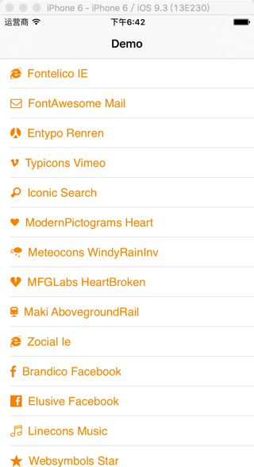

#Fontello-Swift

[](https://raw.githubusercontent.com/chisj/Fontello-Swift/master/LICENSE)&nbsp;
[](http://cocoapods.org/?q=Fontello-Swift)&nbsp;

Fontello icon font library for Swift. support icon fonts from [http://fontello.com/](http://fontello.com/)



##Requirements

* iOS 8.0+
* Swift 2.2

##Installation

```
use_frameworks!
pod 'Fontello-Swift'

```
Or install specified fonts

```
pod 'Fontello-Swift/FontAwesome'
pod 'Fontello-Swift/Fontelico'
pod 'Fontello-Swift/Iconic'
pod 'Fontello-Swift/Entypo'
pod 'Fontello-Swift/Typicons'
pod 'Fontello-Swift/ModernPictograms'
pod 'Fontello-Swift/MFGLabs'
pod 'Fontello-Swift/Meteocons'
pod 'Fontello-Swift/Maki'
pod 'Fontello-Swift/Zocial'
pod 'Fontello-Swift/Linecons'
pod 'Fontello-Swift/Brandico'
pod 'Fontello-Swift/Elusive'
pod 'Fontello-Swift/Websymbols'

```
##Usage

```
import Fontello_Swift

label.font = FontAwesome.fontOfSize(17)
label.text = FontAwesome.stringWithName(.Mail)
```


##License
Fontello-Swift is available under the MIT license. See the [LICENSE](LICENSE) file for more info.

##Fonts License

Fontelico by Crowdsourced, for Fontello project license: SIL

Font Awesome v4.3.0 by Dave Gandy license: SIL

Entypo v2.0 by Daniel Bruce license: SIL

Typicons v2.0.2 by Stephen Hutchings license: SIL

Iconic v1.0 by P.J. Onori license: SIL

Modern Pictograms by John Caserta license: SIL

Meteocons by Alessio Atzeni license: SIL

MFG Labsby MFG Labslicense: SIL

Maki by Mapbox license: BSD

Zocial by Sam Collins license: MIT

Brandico by Crowdsourced, for Fontello project license: SIL

Elusive by Aristeides Stathopoulos license: SIL

Linecons by Designmodo for Smashing Magazine license: CC BY

Web Symbols by Just Be Nice studio license: SIL

more info refer to [http://fontello.com/](http://fontello.com/)

